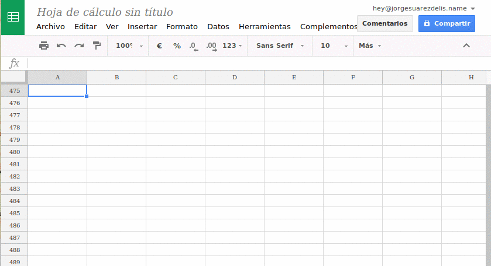

Detective Pikachu es un bot de Telegram especializado en crear listados de participantes en incursiones de Pokémon GO.

Puedes pedir ayuda en el grupo [@detectivepikachuayuda](https://t.me/detectivepikachuayuda) y estar informado de las novedades en el canal [@detectivepikachunews](https://t.me/detectivepikachunews).

1. [Ayuda para entrenadores](#ayuda-para-entrenadores)
   1. [Registrarse en el bot](#registrarse-en-el-bot)
   2. [Crear una incursión](#crear-una-incursión)
   3. [Editar, cancelar, borrar y reflotar una incursión](#editar-cancelar-borrar-y-reflotar-una-incursión)
   4. [Apuntarse a una incursión](#apuntarse-a-una-incursión)
   5. [Alertas de incursiones](#alertas-de-incursiones)
   6. [Estadístcas](#estadísticas)
   7. [Más ayuda](#más-ayuda)
2. [Ayuda para administradores](#ayuda-para-administradores)
   1. [Grupos y canales](#grupos-y-canales)
   2. [Añadir el bot a un grupo o canal](#añadir-el-bot-a-un-grupo-o-canal)
   3. [Configuración](#configuración)
   4. [Ubicaciones de gimnasios](#ubicaciones-de-gimnasios)
      1. [Mejorar palabras clave](#mejorar-palabras-clave)
      2. [Etiquetas](#etiquetas)
      3. [Zonas](#zonas)
      4. [Límites en número de zonas y ubicaciones de gimnasios](#límites-en-número-de-zonas-y-ubicaciones-de-gimnasios)
   5. [Modo niñero](#modo-niñero)
   6. [Zona horaria](#zona-horaria)
   7. [Idioma](#idioma)
   8. [Rankings](#rankings)
   9. [Otros comandos exclusivos para administradores](#otros-comandos-exclusivos-para-administradores)
3. [Política de tramposos](#política-de-tramposos)
4. [Protección de datos](#protección-de-datos)
5. [Problemas frecuentes](#problemas-frecuentes)

## Ayuda para entrenadores ##

### Registrarse en el bot ###

El registro es obligatorio en algunos grupos (a discreción de los administradores), pero sea obligatorio o no, te permite **mostrar tu nombre de entrenador, equipo y nivel** en las incursiones y **participar en los rankings**.

Para registrarte tienes dos opciones:

1. En un privado con [@detectivepikachubot](https://t.me/detectivepikachubot), escribe el comando `/register` y comenzarás el proceso de registro y validación. El proceso es automatizado y te pedirá que hagas una captura de pantalla del juego con unas condiciones.

2. Si estás registrado y validado con [@profesoroak_bot](https://t.me/profesoroak_bot), puedes sencillamente preguntarle `quién soy?` y reenviar la respuesta a [@detectivepikachubot](https://t.me/detectivepikachubot).

#### Subida de nivel ####

Para indicar una subida de nivel, basta con enviar una captura de pantalla del perfil donde se vea el nuevo nivel, una vez se esté validado. Si el bot no contesta nada, es debido a que el estado de validación no es correcto.

Alternativamente, puedes subir nivel en [@profesoroak_bot](https://t.me/profesoroak_bot) y luego reenviar de nuevo la respuesta de `quién soy?` a [@detectivepikachubot](https://t.me/detectivepikachubot) para actualizar los datos.

#### Cambio de nombre de entrenador ####

Si has cambiado tu nombre de entrenador en el juego, debes volver a hacer el proceso de registro. No hay ninguna restricción, aunque ya estuvieras validado anteriormente con otra cuenta.

#### Cambio de cuenta de Telegram ####

Si has cambiado de número de teléfono y prefieres utilizar el bot con la cuenta de Telegram correspondiente al nuevo número, solicita un reseteo de tu cuenta anterior, para que puedas validarte con la nueva, en el correo electrónico [validations@detectivepik.ac](mailto:validations@detectivepik.ac)

### Crear una incursión ###

Se puede crear una incursión de forma interactiva con el comando:

    /raid

También se pueden especificar los parámetros directamente, algo que es necesario si alguno de los parámetros no aparece en el menú de creación interactivo. La sintaxis para crear una incursión nueva de esta forma es sencilla:

    /raid pokemon hora gimnasio

Es importante seguir este mismo orden, sino lo más seguro es que el bot no te entienda. También se puede añadir una hora a la que desaparece el Pokémon.

    /raid pokemon hora gimnasio horafin

Algunos ejemplos:

    /raid Raikou 14:30 Alameda
    /raid Entei 3:30 Plaza de la verdura
    /raid Metapod 12 Plaza Mayor 12:15

En lugar de especificar un Pokémon, se puede especificar un huevo, por ejemplo, para un huevo de nivel 4 se pondría *N4*:

    /raid N4 13:00 Alameda

Para crear incursiones EX se debe utilizar la palabra *EX* y especificar el día de la incursión con el siguiente formato:

    /raid EX dia/hora gimnasio

Por ejemplo, para una incursión EX el día 12 a las 15:30 en el gimnasio Crucero:

    /raid EX 12/15:30 Crucero

Para poder crear una incursión es **necesario tener un alias** definido en Telegram y. Además, algunos grupos exigen **estar validado** en el bot. Si no puedes crear una incursión por alguno de estos motivos, el bot te informará.

### Editar, cancelar, borrar y reflotar una incursión ###

Se pueden editar y añadir todos los detalles de la incursión después de crearla: cambiar la hora, el gimnasio, el Pokémon (o el huevo) y la hora a la que desaparece.

Para editar o añadir cualquiera de estos detalles, el creador de la incursión puede contestar al mensaje de la incursión con uno de estos comandos:

    /time 12:00
    /pokemon Wartortle
    /gym Plaza de Abastos
    /endtime 12:30
    /endtime -

En el caso de pasar una barra horizontal - como argumento a `/endtime`, se borrará la hora de fin.

Una incursión también puede ser **cancelada** contestando con el comando `/cancel`, ser **borrada** con el comando `/delete` y ser **reflotada** con el comando `/refloat`.

Las incursiones se finalizan automáticamente pasada media hora desde la hora de creación, pero se puede **forzar la finalización** con el comando `/close`. Este comando solo se puede utilizar pasada la hora de inicio de la incursión.

Los participantes recibirán **avisos por privado** cuando se edite, cancele o borre una incursión.

Ten en cuenta que los comandos `/delete` y `/refloat` por defecto solo están activados para los administradores de los grupos y solo algunos grupos permiten que los usen los propios creadores de las incursiones.

Al editar una hora hay las mismas restricciones que al crear la incursión. Con `/time` es **necesario especificar el día** si no es el día actual. Con `/endtime`, sin embargo, no es necesario, ya que por defecto se toma el mismo día en que se realiza la incursión.

### Apuntarse a una incursión ###

Una vez creada la incursión, puedes apuntarse pulsando en el botón **Voy**. Si te apuntas unos pocos minutos antes de la hora fijada, o incluso después, podrías aparecer con un icono de un caracol 🐌 en el listado, dependiendo de cómo esté configurado el grupo.

Si vas con acompañantes, puedes pulsar el botón **+1** por cada acompañante adicional. Si te has pasado, pulsa en **Voy** para poner esta cuenta a cero y volver a empezar. Ten en cuenta que los administradores de los grupos pueden limitar el número de acompañantes permitidos o deshabilitar completamente esta opción.

Cuando estés en el lugar de la incursión, puedes pulsar el botón **Estoy ahí** para indicarlo.

Si te has apuntado pero no vas a ir, pulsa en **No voy**. Si han pasado más de cinco minutos desde que te apuntaste, permanecerás en la lista con una ❌ para que la gente sepa que te has desapuntado.

Una vez llegue la hora de la incursión y hasta seis horas más tarde, puedes informar si has capturado al Pokémon de la incursión pulsando en **Lo tengo** o **Ha escapado**. Ten en cuenta que estos botones no están activados por defecto y los administradores de los grupos pueden decidir no habilitarlos.

Para poder apuntarse a una incursión es **necesario tener un alias** definido en Telegram. Además, algunos grupos exigen **estar validado** en el bot. Si no puedes apuntarte por alguno de estos motivos, el bot te informará.

### Alertas de incursiones ###

Los usuarios pueden configurar alertas por mensaje privado cuando se creen incursiones en determinados gimnasios. Para configurarlas, utiliza el comando `/alerts` por privado al bot y sigue las instrucciones.

Con `/addalert` seguido del identificador numérico del gimnasio, añades una alerta para ese gimnasio. Usando `/delalert` seguido del identificador numérico, borras la alerta para ese gimnasio. Con `/clearalerts` borras todas las alertas.

Ten en cuenta que antes de configurar las alertas tienes que haber participado en alguna incursión en un grupo con las ubicaciones de los gimnasios coniguradas y la opción de permitir alertas activada.

### Estadísticas ###

Los usuarios pueden solicitar sus estadísticas de participación de la semana pasada con el comando `/stats`. Las estadísticas tan sólo cuentan las incursiones en las que ha pulsado el botón de **Estoy** y se ha apuntado antes de la hora de inicio de la incursión.

### Más ayuda ###

Si necesitas ayuda que no se encuentre en este manual, puedes preguntar en [@detectivepikachuayuda](https://t.me/detectivepikachuayuda). Si estás administrando un grupo o un canal, mira más abajo para ver la ayuda para administradores.

## Ayuda para administradores ##

### Grupos y canales ###

El bot se puede añadir a grupos y a canales, pero funciona de manera ligeramente distinta en ambos casos, en parte por el propio funcionamiento de Telegram.

En **grupos** el bot ya se puede utilizar tan pronto entra al grupo y envía un saludo. Conviene configurarlo, no obstante. Ten cuidado porque, si una vez añadas el bot conviertes el grupo a supergrupo, tendrás que volver a configurarlo. Un supergrupo es la mejor opción en la mayoría de los casos.

En **canales** el bot no saluda al entrar y necesita configurarse con `/settings` antes de poder utilizarse. También funciona algo más lento y hay algunas diferencias más. En un canal, no mostrará el creador de la incursión porque la incursión siempre la crea el canal, no un usuario. Además, algunas de las opciones no tienen sentido para canales. Usar un canal es una opción sencilla si se quiere integrar con otros bots, ya que un bot no puede leer el mensaje de otro bot en un grupo.

### Añadir el bot a un grupo o canal ###

Para **añadir el bot a un grupo** tienes tres alternativas:

1. Vete al perfil de [@detectivepikachubot](https://t.me/detectivepikachubot). En el menú, selecciona la opción *Añadir a un grupo* y escoge el grupo de la lista.

2. Pulsa en [este enlace](https://telegram.me/detectivepikachubot?startgroup=true) en un dispositivo donde tengas Telegram instalado.

3. Puedes intentar añadirlo como un contacto más desde el grupo con su alias `@detectivepikachubot`, pero en versiones recientes de Telegram hay problemas usando este método.

Para **añadir el bot a un canal** las opciones son más limitadas. Tienes que ir a la gestión de administradores y **añadirlo directamente como administrador**, buscándolo como un contacto más con su alias `@detectivepikachubot`.

Con versiones recientes de Telegram no se pueden añadir bots de esta forma. Si es tu caso, descarga la beta para Android desde [el canal Beta de Telegram](http://t.me/tgrambeta) buscando el archivo `tgrambeta.apk` más reciente. Telegram Beta se instala como una aplicación aparte y, una vez añadas el bot, puedes desinstalarla.

### Configuración ###

Para hacer la configuración básica del bot utiliza el comando `/settings`. La configuración está dividida en varios submenús:

#### Funcionamiento del grupo/canal ####

1. **Ubicaciones**. Activa o desactiva la integración de las ubicaciones. Para poder utilizar esta opción, debes [configurar las ubicaciones](#ubicaciones-de-gimnasios). Si no vas a hacerlo, es mejor que la desactives. Opción activada por defecto.

2. **Permitir configurar alertas**. Requiere la opción *Ubicaciones* (se marca automáticamente si es necesario). Permite o no que los usuarios encuentren los gimnasios configurados en este grupo/canal a la hora de configurarse alertas por privado. Opción activada por defecto.

3. **Modo niñero**. Borra todos los mensajes excepto los mensajes de creación de incursiones y los comandos permitidos. Mira el  [apartado del modo niñero](#modo-niñero) para más información. Opción desactivada por defecto.

4. **Validación obligatoria**. Si está activada, obliga a todos los usuarios a validarse en el bot antes de poder participar en incursiones o crearlas. Opción desactivada por defecto.

5. **Reflotar automático**. Si está activada, esta opción hace que el bot reflote todas las incursiones activas cada 5, 10, 15 o 30 minutos. Las incursiones se consideran activas si falta **menos de una hora y media para que comiencen** o si acaban de comenzar (una vez comenzadas, se reflotarán una única vez). Opción desactivada por defecto.

#### Comandos disponibles para usuarios ####

1. **Consultar gimnasios (comando /search)**. Si está activada, permite que los usuarios consulten localizaciones de los gimnasios. Opción desactivada por defecto.

2. **Crear incursiones (comando /raid)**. Si está activada, permite que los usuarios creen incursiones. Opción activada por defecto.

3. **Reflotar incursiones (comando /refloat)**. Si está activada, permite que los creadores de las incursiones las refloten utilizando el comando `/reflotar`. Opción desactivada por defecto.

4. **Borrar incursiones (comando /delete)**. Si está activada, permite que los creadores de las incursiones las borren utilizando el comando `/delete`. Si desactivas esta opción, todavía pueden cancelarlas con el comando `/cancel`. Opción activada por defecto.

#### Opciones de vista de incursiones ####

1. **Mostrar totales disgregados**. Si está activada, en lugar de mostrar un único total de entrenadores apuntados, lo disgrega además por equipos. Opción desactivada por defecto.

2. **Mostrar «+1» disgregados por línea**. Requiere la opción *Boton «+1» por cada equipo* del apartado *Funcionamiento de incursiones* (se marca automáticamente si es necesario). Si está activada, muestra los +1 con el color correspondiente en cada línea. Opción desactivada por defecto.

3. **Mostrar horas en formato AM/PM**. Si está activada, muestra las horas con el formato de 12 horas seguido de AM o PM. Solo afecta a la visualización de las incursiones. Opción desactivada por defecto.

4. **Tema de iconos**. Permite cambiar el tema de iconos entre uno de los disponibles. Cada vez que lo pulsas, cambia el tema por otro entre los temas disponibles.

5. **Agrupar apuntados por nivel/equipo**. En lugar de mostrar los apuntados por orden temporal, los agrupa por equipo y por nivel. Opción desactivada por defecto.

6. **Ordenar zonas/gimnasios por actividad**. Al crear incursiones de forma interactiva, mostrar las zonas y los gimnasios ordenados de mayor a menor actividad, en lugar de usar únicamente el orden alfabético. Opción activada por defecto.

7. **Marcar apuntados tarde**. Marca en el listado los entrenadores que se hayan apuntado tarde con un 🐌. Se puede configurar para 1, 3, 5 o 10 minutos antes de la hora fijada de la incursión. Opción activada por defecto con 1 minuto.

#### Funcionamiento de incursiones ####

1. **Botón «Tardo»**. Si está activada, aparecerá un nuevo botón en las incursiones para que los entrenadores puedan avisar si van a llegar tarde. Opción desactivada por defecto.

2. **Botones «¡Lo tengo!»**. Si está activada, aparecerán unos botones que permiten mostrar si has capturado o no el Pokémon de la incursión. Los botones solo aparecen a partir de la hora de inicio de la incursión y durante las siguientes seis horas. Opción desactivada por defecto.

3. **Botón «+1»**. Si está activada, aparecerá un botón que permite indicar que vas con acompañantes a la incursión. Se puede configurar un máximo de 1, 2, 3, 5 y 10 acompañantes. Opción activada por defecto y configurada con 5 acompañantes como máximo.

4. **Botón «+1» por cada equipo**. Requiere la opción *Botón «+1»* (se marca automáticamente si es necesario). Si está activada, muestra tres botones «+1», uno por equipo, en vez de un único botón. Esta opción solo tiene sentido si tienes activada la opción de vista de incursión *Mostrar totales disgregados* o *Mostrar «+1» disgregados por línea*. Opción desactivada por defecto.

#### Funcionamiento de rankings ####

1. **Ranking Semanal**. Si está activado, permite a los administradores de un grupo mostrar un TOP 5, 10, 15, 20 o 25 semanal de participación en incursiones (según la opción seleccionada, por defecto 10) utilizando el comando `/ranking week` (o simplemente `/ranking`).

2. **Ranking Mensual**. Si está activado, permite a los administradores de un grupo mostrar un TOP 15, 25, 35 o 50 mensual de participación en incursiones (según la opción seleccionada, por defecto 15) utilizando el comando `/ranking month`.

3. **Publicar automáticamente**. Si la opción está activada, publicará los rankings que no estén desactivados de forma automática tan pronto como estén disponibles.

### Ubicaciones de gimnasios ###

Las ubicaciones de los gimnasios tienen que configurarse en cada grupo de forma independiente. Un grupo no conoce las ubicaciones de los demás grupos.

Para comenzar, debes crear una [hoja de cálculo de Google](https://docs.google.com/spreadsheets/u/0/) con 4 columnas (y 2 opcionales que puedes cubrir más tarde):

1. Nombre del gimnasio
2. Latitud en formato numérico (por ejemplo 42.211345)
3. Longitud también en formato numérico
4. Palabras clave separadas por comas (pueden tener espacios)
5. Etiquetas (opcional)
6. Zonas (opcional)

Esta lista se puede generar a partir de los gimnasios de Gymhuntr [siguiendo esta guía](http://telegra.ph/Lista-de-gimnasios-para-Detective-Pikachu-10-06). Ahorra muchísimo tiempo, así que es recomendable hacerlo así.

Por defecto, Google intenta formatear los números y los estropea. Antes de empezar a escribir los datos, debes seleccionar las columnas B y C y eliminar el formato, como se muestra en la siguiente animación.

La cuarta columna es **muy importante**, ya que es la que permite encontrar los gimnasios. Revisa la sección sobre [mejorar palabras clave](#mejorar-palabras-clave) con calma.

La quinta columna es opcional y siempre puedes cubrirla más tarde. Revisa la sección sobre [etiquetas](#etiquetas) donde se explica más en detalle.

La sexta columna también es opcional. Revisa la sección sobre [zonas](#zonas) donde se explica más en detalle.

Una vez tengas lista la hoja de cálculo, debes pulsar en el botón **Compartir** para obtener un enlace público a la hoja de cálculo y establecerlo con el comando `/spreadsheet` en el grupo. Por ejemplo:

    /spreadsheet https://docs.google.com/spreadsheets/d/1s2K8_hayc1aHt8bZeKucRz0s4G4rn9YUrDB2ZvvEJ4A/edit?usp=sharing

Una vez establecida, debes utilizar el comando `/refresh` para que la cargue. Cada vez que hagas cambios, debes volver a utilizar `/refresh` para recargar la lista. No es necesario volver a utilizar `/spreadsheet` a no ser que cambies la hoja de cálculo por otra.

Se pueden probar las ubicaciones preguntando por ellas con el comando `/search`. Por ejemplo:

    /search león de boca abierta

Para listar todos los gimnasios conocidos puedes usar el comando `/list`. Este comando puede mostrar la lista cortada si hay demasiados gimnasios, sobre 120 gimnasios o más.

**¡Importante!** Si les cambias el nombre (primera columna), los gimnasios se borran y se vuelven a crear, y todas las alertas que los usuarios tuvieran creadas se pierden. También puede afectar a incursiones en curso.

#### Mejorar palabras clave ####

Cuando crees las palabras clave ten en cuenta que las tildes y mayúsculas se ignoran. Además, los caracteres como «ç» y «ñ» se transforman a «c» y «n». Es decir, la palabra clave *Peñíscola* a efectos de búsqueda es la misma que *peniscola*. Puede haber varias palabras clave separadas por comas y se ignoran los espacios entre las comas y las palabras.

El bot utiliza las palabras clave para encontrar la ubicaciones. Busca por orden de arriba a abajo en el documento y empezando por la primera hasta la última palabra clave si alguna de las palabras clave esté **contenida** en el texto que escribe el usuario.

Por ejemplo, el usuario puede buscar *Estación de trenes*. Supongamos que además el gimnasio se llama así. Unas buenas palabras clave serían: *estación tren, estación de tren*.

Supongamos que el gimnasio en realidad se llama *Escultura al trabajo bien hecho*, pero el usuario se ha referido a él como *Estación de trenes* porque habitualmente se le llama así. Unas buenas palabras clave en este caso serían: *estación tren, estación de tren, escultura al trabajo, escultura trabajo, trabajo bien*.

Por un momento supongamos que hay otro gimnasio en una estación de autobuses. El gimnasio se llama *Monolito de piedra* por un monolito que hay allí, pero la gente habitualmente le llama *estación de autobuses*. Unas buenas palabras clave serían: *estación auto, estación de auto, monolito piedra, monolito de piedra*.

Habiendo dos estaciones, es importante que **no** se utilice la palabra *estación* suelta, porque podría coincidir el gimnasio equivocado. Tendría que ir acompañada siempre de otras palabras.

##### ¿Qué hacer si se reconoce el gimnasio equivocado? #####

Te recomendamos leer con atención el apartado anterior, pero lo explicamos una vez más con otro ejemplo un poco más complicado.

Supongamos que hay dos gimnasios llamados *Fuente*. Si utilizas como palabra clave *Fuente* de forma suelta, reconocerá uno de los dos, el primero que hayas puesto en el listado.

Si ambos gimnasios tienen la misma importancia, deberías mejorar las palabras clave añadiendo más información. Aunque se llamen igual en el juego, la gente los llamará de otra forma para diferenciarlos. Aprovecha eso para mejorar las palabras clave. Por ejemplo, una podría tener de palabra clave *fuente de la alameda* y la otra *fuente de la plaza de toros*.

Si uno de los gimnasios apenas se utiliza porque está muy lejos o no suelen salir incursiones allí, puedes hacer esto mismo pero dejando la palabra clave *fuente* al gimnasio con mayor importancia.

#### Etiquetas ####

Las etiquetas sirven para marcar los gimnasios con determinados emojis, que sirven para identificarlos mejor como potenciales receptores de una incursión EX.

Las etiquetas se ponen en la quinta columna como las palabras clave, separadas por comas. Las soportadas son las siguientes:

* `parque` - El gimnasio se encuentra dentro de un parque (🌳).
* `jardín` (se puede poner con o sin tilde) - El gimnasio se encuentra dentro de un jardín (🌷).
* `juegos` - El gimnasio se encuentra dentro de un parque de juegos (⚽️).
* `hierba` o `campo` - El gimnasio se encuentra en un campo o terreno con hierba (🌱).
* `patrocinado` - Es un gimnasio patrocinado (💵).
* `ex` - Ha tenido incursiones EX en el pasado fuera del periodo de pruebas (🌟).

Para saber si un gimnasio está realmente considerado como potencial receptor de una incursión EX, puedes utilizar [guías como esta](https://www.reddit.com/r/TheSilphRoad/comments/7pq1cx/how_i_created_a_map_of_potential_exraids_and_how/). Ten en cuenta que el criterio no está completamente definido y puede cambiar con el tiempo.

#### Zonas ####

Las zonas tan sólo se utilizan con el modo de creación interactivo de incursiones, con el objetivo de facilitar encontrar los gimnasios. Se pueden asociar, por ejemplo, a barrios, o a divisiones de una ciudad (Zona Norte, Zona Sur...).

Las zonas se establecen en la sexta columna. Pueden configurarse varias para el mismo gimnasio separadas por comas. Por ejemplo:

    Polígono Industrial, Zona Norte

Ten en cuenta que, si añades estos datos en algún gimnasio, los gimnasios que no tengan este dato cubierto no aparecerán como opción al crear una incursión de forma interactiva, pero podrán seguir seleccionándose por palabras clave.

#### Límites en número de zonas y ubicaciones de gimnasios ####

El número máximo de gimnasios que se cargarán de la hoja de cálculo es **3000**. A partir de ese número, se ignorarán.

En la creación de incursiones con el comando `/raid` se mostrará un **máximo de 56 gimnasios**, ordenados de mayor a menor uso en los últimos 60 días. Si se quiere mostrar más gimnasios, se recomienda crear zonas. Se mostrará un **máximo de 12 zonas**, así que si el número de zonas es mayor, las zonas con menor uso no aparecerán.

Combinando el número máximo de zonas con el número máximo de gimnasios por zona, pueden mostrarse hasta un total de 56*12=**672 gimnasios**.

Esto no quiere decir que sea obligatorio crear zonas si se quiere mostrar más de 56 gimnasios. Lo ocurre es que solo se podrán seleccionar los 56 más concurridos usando el comando `/raid` sin argumentos, pero siempre se podrán seleccionar los menos concurridos usando las palabras clave.

### Modo niñero ###

El modo niñero evita que la gente hable en un grupo, borrando todos los mensajes que pongan los usuarios (no los administradores).

El comando `/talkgroup` permite definir un grupo para hablar. Si está el modo niñero activado, el bot recordará el enlace al grupo para hablar cada vez que hable alguien. Por ejemplo:

    /talkgroup @PGSDC
    /talkgroup https://t.me/joinchat/XXs3XkzYsXXxnvbtxxe11x

Para eliminar el grupo para hablar se puede pasar una barra horizontal como argumento, es decir:

    /talkgroup -

### Zona horaria ###

El bot reconoce la hora que escriben los usuarios y hace operaciones con ellas, por lo que es importante que la hora que utilice el bot se corresponda con la hora real de tu grupo.

Para establecer la zona horaria correcta se debe utilizar el comando `/timezone` con la zona horaria correspondiente como parámetro siguiendo el formato del [listado de zonas horarias de la IANA](https://en.wikipedia.org/wiki/List_of_tz_database_time_zones). Por ejemplo:

    /timezone Europe/Madrid
    /timezone Atlantic/Canary

### Idioma ###

El bot soporta varios idiomas. Para ver los idiomas disponibles, utiliza el comando `/language`.

Al entrar a un grupo por primera vez o al hablar con usuario por primera vez por privado, el bot preguntará antes el idioma deseado. Siempre se puede cambiar más adelante con el comando `/language idioma`. Por ejemplo:

    /language Portuguese

Si un usuario interacciona por primera vez con el bot desde un grupo, se le asignará automáticamente el idioma del grupo y no se le preguntará por privado. En este caso, el usuario también puede cambiar el idioma por privado de la misma forma.

### Rankings ###

El bot puede mostrar los rankings de la **semana pasada** (contando de lunes a domingo) y del **mes pasado**, con los comandos `/ranking week` (o simplemente `/ranking`) y `/ranking month`.

En estos rankings aparecen ordenados por participación en incursiones el número de usuarios [configurado en el grupo o canal](#funcionamiento-de-rankings). Por defecto, un TOP 10 semanal y un TOP 15 mensual.

En caso de empate en número de incursiones, se muestran en la misma posición. Solo se tienen en cuenta los usuarios que se han apuntado a la incursión **antes de la hora de inicio** y que han pulsado el botón de **Estoy**.

Los rankings están disponibles a partir de las 10 de la noche del día anterior a que termine el periodo correspondiente. Es decir, el ranking mensual estará disponible a las 10 de la noche del último día del mes.

### Otros comandos exclusivos para administradores ###

Para revertir la cancelación de una incursión puedes usar el comando `/uncancel`. Se utiliza exactamente igual que el `/cancel`, pero sobre incursiones canceladas.

Un administrador siempre puede cancelar incursiones con el comando `/cancel`, aunque sean antiguas. Normalmente, un creador de incursión solo puede cancelar incursiones que no sean más antiguas de tres horas.

Para reflotar todas las incursiones activas una vez, sin necesidad de usar el reflotado automático, se puede usar el comando `/refloatactive`. También se pueden reflotar todas las incursiones, incluídas las EX que transcurrirán dentro de varias horas o días, con `/refloatall`.

# Política de tramposos #

Este bot no puede ser utilizado en grupos o canales que promueven el uso de trampas en el juego. Si bien no se puede evitar que sea utilizado casi por cualquiera, el bot implementa algunas medidas anti-trampas que detectan determinados comportamientos que pueden llevar a un baneo preventivo.

En caso de ser baneado, el bot no contestará ningún comando ni permitirá apuntarse a las incursiones. Para comprobar si tu cuenta está baneada, puedes utilizar el comando `/profile` por privado. El estado de tu cuenta será **Baneada**.

Si crees que se te ha baneado por error, pásate por el [grupo de ayuda](https://t.me/detectivepikachuayuda) y pide que revisen tu caso.

# Protección de datos #

Este bot recoge la siguiente información sobre sus usuarios en un fichero automatizado:

  * Identificador numérico de Telegram
  * Alias público de Telegram
  * Estado de la cuenta (validada, no validada o baneada)
  * Datos relacionados con la cuenta de Pokémon GO facilitados por el usuario: equipo, nombre de entrenador y nivel

Estos datos son necesarios para el correcto funcionamiento del bot y no son compartidos en ningún caso con otros usuarios ni terceros. El alias público de Telegram y los datos relacionados con la cuenta de Pokémon GO sí aparecerán en listados de incursiones y rankings de los grupos, en caso de participar en incursiones o crearlas. El acceso a estos datos será público o no dependiendo de la configuración de cada grupo.

En caso de querer eliminar los datos almacenados en el fichero automatizado, se debe enviar un correo a `validations@detectivepik.ac` indicándolo. El bot guardará el identificador numérico de Telegram junto con una marca que indica este deseo. En este caso, no será posible utilizar el bot y el estado de la cuenta aparecerá como **baneada**.

El bot también almacena unos ficheros no ordenados con las interacciones en grupos y directas con el bot en los últimos 60 días (*logs*), con el objetivo de poder trazar problemas técnicos y atender a las apelaciones de baneo.

# Problemas frecuentes #

## Error: No hay información sobre el grupo ##

El bot debe saludar al entrar en un grupo. Hasta que lo haga, no se creará la información necesaria para que funcione.

Si has convertido el grupo en supergrupo, a efectos del bot es **un grupo diferente** y debes echarlo y volverlo a meter para que vuelva a saludar y crear la información necesaria. Ten en cuenta que al convertir un grupo en supergrupo, se perderán todas las configuraciones realizadas y las incursiones antiguas dejarán de funcionar.

**Nota**: Echar al bot y volverlo a meter en un grupo o un supergrupo ya configurados no hace que se borre la información configurada ni dejarán de funcionar las incursiones.

## Error: No hay información sobre el canal ##

En los canales, se debe configurar el bot al menos una vez con `/settings` para que se cree la información necesaria, ya que no saluda el entrar a un canal.
